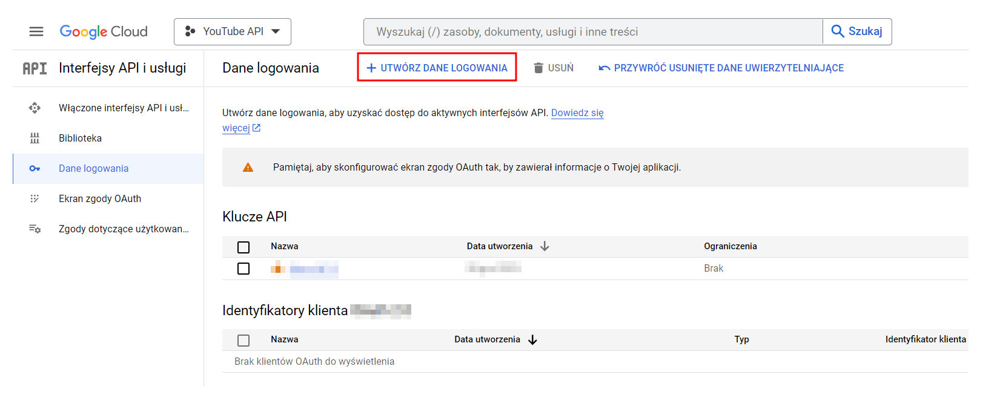
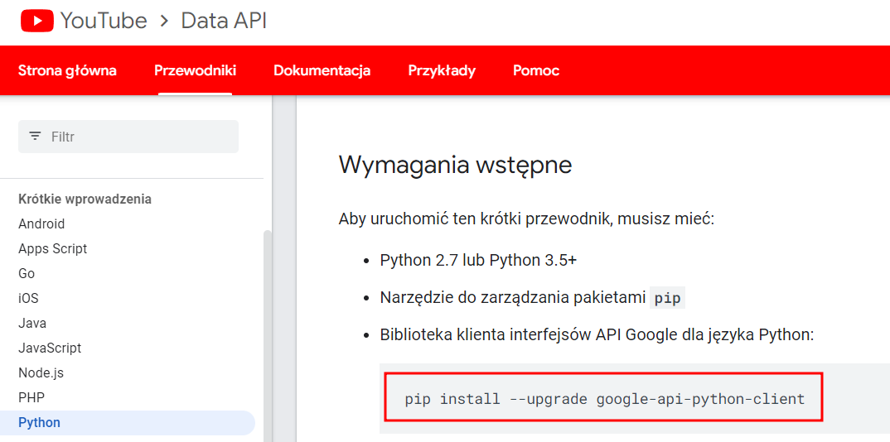

# YouTube API Analysis

In this project I performed exploratory data analysis on YouTube data that I extracted using API

## Objectives

- Extract data from YouTube channels using API
- Transform it from JSON file to Pandas Dataframe
- Clean data (change formats, etc.)
- Create Visualizations

## Deployment

- Generate an API key

- Set up an enviroment in Jupyter Notebooks by using "pip install"

## Authors

- [@Szymon Poparda](https://www.github.com/octokatherine)

