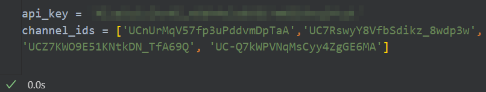
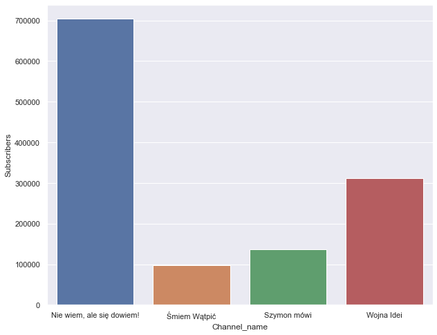
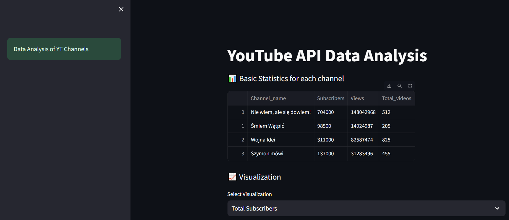

# YouTube API Analysis

In this project I performed exploratory data analysis on YouTube data that I extracted using API


## Objectives

- Extract data from YouTube channels using API
- Transform it from JSON file to Pandas Dataframe
- Clean data (change formats, etc.)
- Create Visualizations


## Deployment

- Generate an API key
  


- Set up an enviroment in Jupyter Notebooks by using "pip install"
  


- Loading the data
``` python
from googleapiclient.discovery import build
import pandas as pd
from IPython.display import JSON
```



``` python
api_service_name = "youtube"
api_version = "v3"

# Get credentials and create an API client
youtube = build(
    api_service_name, api_version, developerKey=api_key)
```

``` python
# view response
request = youtube.channels().list(
    part="snippet,contentDetails,statistics",
    id=','.join(channel_ids)
)
response = request.execute()
print(response)
```

``` python
# put data into a list
def get_channel_stats(youtube, channel_ids):
    all_data = []
    request = youtube.channels().list(
        part="snippet,contentDetails,statistics",
        id=','.join(channel_ids)
    )
    response = request.execute()

    for i in range(len(response['items'])):
        data = dict(Channel_name = response['items'][i]['snippet']['title'],
                    Subscribers = response['items'][i]['statistics']['subscriberCount'],
                    Views = response['items'][i]['statistics']['viewCount'],
                    Total_videos = response['items'][i]['statistics']['videoCount'])
        all_data.append(data)
        
    return all_data
```

``` python
channel_statistics = get_channel_stats(youtube, channel_ids)
channels_data_df = pd.DataFrame(channel_statistics)
channels_data_df
```

- Change data types
``` python
channels_data_df['Subscribers'] = pd.to_numeric(channels_data_df['Subscribers'])
channels_data_df['Views'] = pd.to_numeric(channels_data_df['Views'])
channels_data_df['Total_videos'] = pd.to_numeric(channels_data_df['Total_videos'])
channels_data_df.dtypes
```

- Visualize
``` python
import seaborn as sns
sns.set(rc={'figure.figsize':(10,8)})
ax = sns.barplot(x='Channel_name', y='Subscribers', data=channels_data_df)
```



- Hosting on streamlit
(https://psychic-space-fiesta-jjqr649r6qfp7wj-8502.app.github.dev/)




## Authors

- [@Szymon Poparda](https://www.github.com/octokatherine)

