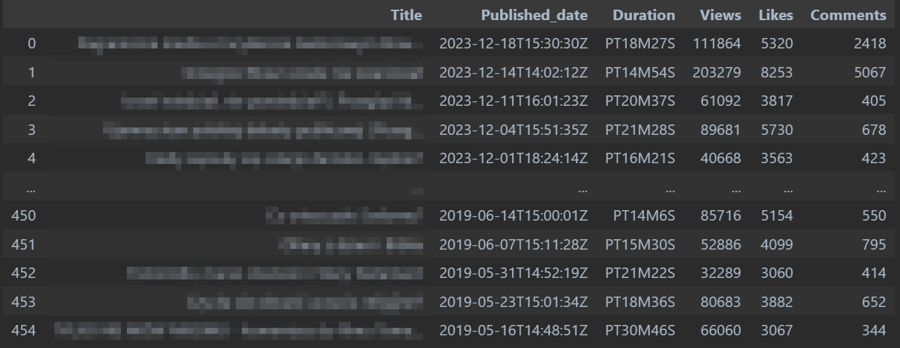
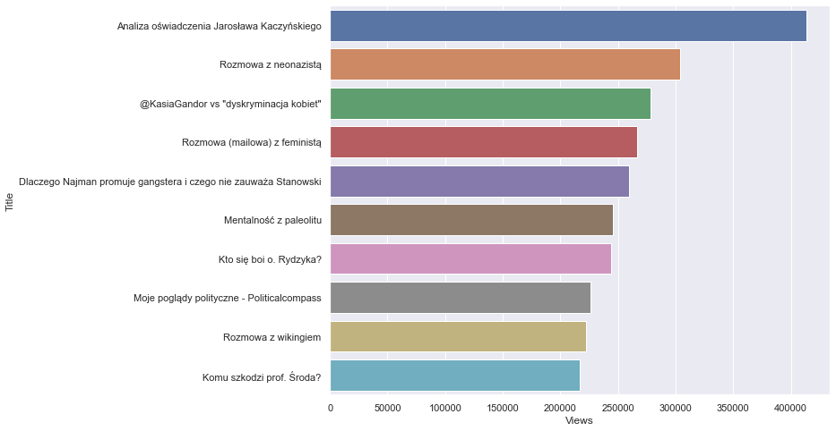
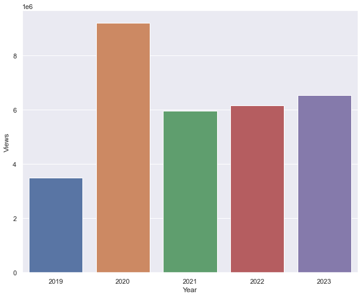
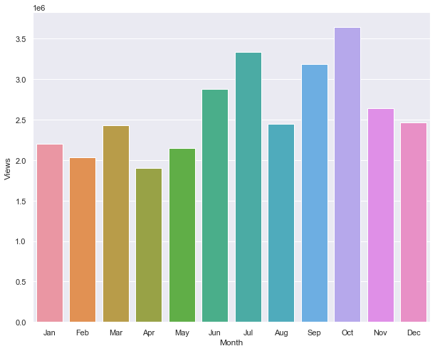

# YouTube API Analysis

In this project I performed exploratory data analysis on YouTube data that I extracted using API


## Objectives

- Extract data from YouTube channels using API
- Transform data from JSON file to Pandas Dataframe
- Clean data (change date format, convert to numeric etc.)
- Create Visualizations


# Deployment
## Getting statistics for the channels

- Generate an API key
  


- Set up an enviroment in Jupyter Notebooks by using "pip install"
  


- Loading the data
``` python
from googleapiclient.discovery import build
import pandas as pd
from IPython.display import JSON
```


``` python
api_service_name = "youtube"
api_version = "v3"

# Get credentials and create an API client
youtube = build(
    api_service_name, api_version, developerKey=api_key)
```

``` python
# view response
request = youtube.channels().list(
    part="snippet,contentDetails,statistics",
    id=','.join(channel_ids)
)
response = request.execute()
print(response)
```

``` python
# put data into a list
def get_channel_stats(youtube, channel_ids):
    all_data = []
    request = youtube.channels().list(
        part="snippet,contentDetails,statistics",
        id=','.join(channel_ids)
    )
    response = request.execute()

    for i in range(len(response['items'])):
        data = dict(Channel_name = response['items'][i]['snippet']['title'],
                    Subscribers = response['items'][i]['statistics']['subscriberCount'],
                    Views = response['items'][i]['statistics']['viewCount'],
                    Total_videos = response['items'][i]['statistics']['videoCount'])
        all_data.append(data)
        
    return all_data
```

``` python
channel_statistics = get_channel_stats(youtube, channel_ids)
channels_data_df = pd.DataFrame(channel_statistics)
channels_data_df
```

- Change data types
``` python
channels_data_df['Subscribers'] = pd.to_numeric(channels_data_df['Subscribers'])
channels_data_df['Views'] = pd.to_numeric(channels_data_df['Views'])
channels_data_df['Total_videos'] = pd.to_numeric(channels_data_df['Total_videos'])
channels_data_df.dtypes
```

- Visualize
``` python
import seaborn as sns
sns.set(rc={'figure.figsize':(10,8)})
ax = sns.barplot(x='Channel_name', y='Subscribers', data=channels_data_df)
```

## Getting statistics for the videos

- Choosing the channel that I want to analyse
``` python
choose_channel = 'Szymon mówi'
chosen_channel_ID = channels_data_df.loc[channels_data_df['Channel_name']==choose_channel]['Playlist_id'].iloc[0]
chosen_channel_ID
```

- Collecting video_ids
``` python
def get_video_ids(youtube, chosen_channel_ID):
    request = youtube.playlistItems().list(
    part="contentDetails",
    playlistId=chosen_channel_ID,
    maxResults=50
    )
    response = request.execute()

    video_ids = []

    for i in range(len(response['items'])):
        video_ids.append(response['items'][i]['contentDetails']['videoId'])

    #NEXT PAGE TOKEN
    next_page_token = response.get('nextPageToken')
    more_pages = True

    while more_pages == True:
        if next_page_token is None:
            more_pages = False
        else:
            request = youtube.playlistItems().list(
                part="contentDetails",
                playlistId=chosen_channel_ID,
                maxResults=50,
                pageToken= next_page_token
            )
            response = request.execute()

            for i in range(len(response['items'])):
                video_ids.append(response['items'][i]['contentDetails']['videoId'])

            next_page_token = response.get('nextPageToken')

    return video_ids
  ```
- Getting the video details
``` python
def get_video_details(youtube, video_ids):
    all_video_stats = []

    for i in range(0, len(video_ids), 50):
        request = youtube.videos().list(
            part="snippet,contentDetails,statistics",
            id=",".join(video_ids[i:i+50]) #bierze po 50 itemów z listy, bo więcej się nie dało
        )
        response = request.execute()

        for i in range(len(response['items'])):
            video_stats = dict(
                Title=response['items'][i]['snippet']['title'],
                Published_date=response['items'][i]['snippet']['publishedAt'],
                Duration=response['items'][i]['contentDetails']['duration'],
                Views=response['items'][i]['statistics']['viewCount'],
                Likes=response['items'][i]['statistics']['likeCount'],
                Comments=response['items'][i]['statistics']['commentCount']
            )
            all_video_stats.append(video_stats)

    return all_video_stats
```

``` python
videos_data_df = pd.DataFrame(video_details)
videos_data_df
```


- Change data types
``` python
videos_data_df['Published_date'] = pd.to_datetime(videos_data_df['Published_date']).dt.date
videos_data_df['Views'] = pd.to_numeric(videos_data_df['Views'])
videos_data_df['Comments'] = pd.to_numeric(videos_data_df['Comments'])
videos_data_df['Likes'] = pd.to_numeric(videos_data_df['Likes'])
videos_data_df.dtypes
```

## Analysis
- Find top 10 most successfull videos
``` python
top10_videos = videos_data_df.sort_values(by='Views', ascending=False).head(10)
```

``` python
import matplotlib.pyplot as plt
ax1 = sns.barplot(x='Views', y='Title', data=top10_videos, orient='h')
```


- Statistics by year and month
``` python
videos_data_df['Published_date'] = pd.to_datetime(videos_data_df['Published_date'])
videos_data_df['Year'] = videos_data_df['Published_date'].dt.year
videos_data_df['Month'] = videos_data_df['Published_date'].dt.strftime('%b')
```

By year
``` python
stats_by_year = videos_data_df.groupby(['Year']).sum().reset_index()
stats_by_year = stats_by_year[['Year', 'Views', 'Likes', 'Comments']]
ax1 = sns.barplot(x='Year', y='Views', data=stats_by_year)
```


By month
``` python
stats_by_month = videos_data_df.groupby('Month').sum().reset_index()
stats_by_month = stats_by_month[['Month', 'Views', 'Likes', 'Comments']]
```
``` python
sort_order = ['Jan', 'Feb', 'Mar', 'Apr', 'May', 'Jun', 'Jul', 'Aug', 'Sep', 'Oct', 'Nov', 'Dec']
stats_by_month.index = pd.CategoricalIndex(stats_by_month['Month'], categories=sort_order, ordered=True)
stats_by_month = stats_by_month.sort_index()
```
``` python
ax1 = sns.barplot(x='Month', y='Views', data=stats_by_month)
```



## Summary
With this visualization I completed my project. I found that people are watching the most videos from this particular channel in October, as well as that year 2020 was the best one in terms of positive statistics and many other fascinating things. There are more insights to get from this data so I will surely come back to it.

## Authors

- [@Szymon Poparda](https://www.linkedin.com/in/szymon-poparda-02b96a248/)

